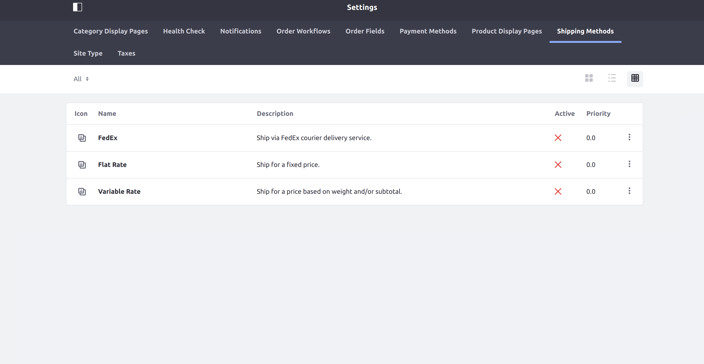
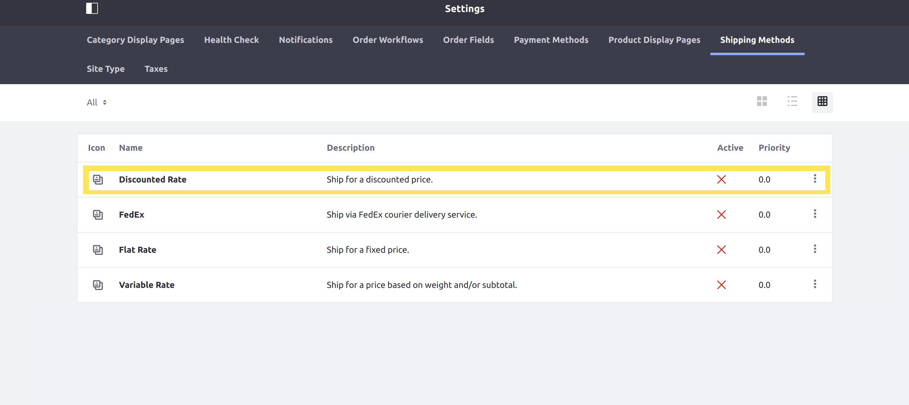

# Implementing a New Shipping Engine

This tutorial will show you how to add a custom shipping engine by implementing the `CommerceShippingEngine` interface.

Shipping engines process shipping options to determine which of the available options will be shown to the user, for what price, and so on. Liferay Commerce provides three shipping engines out of the box: a [flat rate engine](https://github.com/liferay/com-liferay-commerce/blob/2.0.2/commerce-shipping-engine-fixed-web/src/main/java/com/liferay/commerce/shipping/engine/fixed/web/internal/FixedCommerceShippingEngine.java), a [variable rate engine](https://github.com/liferay/com-liferay-commerce/blob/2.0.2/commerce-shipping-engine-fixed-web/src/main/java/com/liferay/commerce/shipping/engine/fixed/web/internal/ByWeightCommerceShippingEngine.java), and the [FedEx engine](https://github.com/liferay/com-liferay-commerce/blob/2.0.2/commerce-shipping-engine-fedex/src/main/java/com/liferay/commerce/shipping/engine/fedex/internal/FedExCommerceShippingEngine.java).

>The FedEx shipping engine is only available for Commerce Enterprise Subscribers.



## Overview

1. **Deploy an Example**
1. **Walk Through the Example**
1. **Additional Information**

## Deploy an Example

In this section, we will get an example shipping engine up and running on your instance of Liferay Commerce. Follow these steps:

1. Start Liferay Commerce.

    ```bash
    docker run -it -p 8080:8080 liferay/commerce:2.0.2
    ```

1. Download and unzip [Acme Commerce Shipping Engine](./liferay-j6x8.zip)

    ```bash
    curl liferay-j6x8.zip
    ```

    ```bash
    unzip liferay-j6x8.zip
    ```

1. Go to `j6x8-impl`.

    ```bash
    cd j6x8-impl
    ```

1. Build and deploy the example.

    ```bash
    ./gradlew deploy -Ddeploy.docker.container.id=$(docker ps -lq)
    ```

    >Note: This command is the same as copying the deployed jars to /opt/liferay/osgi/modules on the Docker container.

1. Confirm the deployment in the Liferay Docker container console.

    ```bash
    STARTED com.acme.j6x8.internal.commerce.model_1.0.0
    ```

1. Verify that the example shipping engine was added. Open your browser to `https://localhost:8080` and navigate to _Site Administration_ → _Commerce_ → _Settings_ → _Shipping Methods_. On this screen, the new shipping method ("Discounted Rate") representing our shipping engine will be present.



Congratulations, you've successfully built and deployed a new shipping engine that implements `CommerceShippingEngine`.

Next, let's dive deeper to learn more.

## Walk Through the Example

In this section, we will take a more in-depth review of the example we deployed. First, we will annotate the class for OSGi registration; second we will implement the `CommerceShippingEngine` interface; and third, we will implement the logic for processing the shipping options.

### Annotate the Class for OSGi Registration

```java
@Component(
    immediate = true,
    property = "commerce.shipping.engine.key=" + J6X8CommerceShippingEngine.KEY,
    service = CommerceShippingEngine.class
)
public class J6X8CommerceShippingEngine implements CommerceShippingEngine {

    public static final String KEY = "Example";
```

> It is important to provide a distinct key for our shipping engine so that Liferay Commerce can distinguish the new engine from others in the [shipping engine registry](https://github.com/liferay/com-liferay-commerce/blob/2.0.2/commerce-service/src/main/java/com/liferay/commerce/internal/util/CommerceShippingEngineRegistryImpl.java). Reusing a key that is already in use will override the existing associated engine.

### Implement the `CommerceShippingEngine` Interface

The following four methods are required:

```java
public String getCommerceShippingOptionLabel(String name, Locale locale);
```

```java
public List<CommerceShippingOption> getCommerceShippingOptions(
        CommerceContext commerceContext, CommerceOrder commerceOrder,
        Locale locale)
    throws CommerceShippingEngineException;
```

```java
public String getDescription(Locale locale);
```

```java
public String getName(Locale locale);
```

To better understand each of the required methods mentioned above, let's look at [J6X8CommerceShippingEngine.java](./liferay-j6x8.zip/j6x8-impl/src/main/java/com/acme/j6x8/internal/commerce/model/J6X8CommerceShippingEngine.java). We will review the implementation of each required method in sequence.

1. `public String getCommerceShippingOptionLabel(String name, Locale locale);`

    ```java
    @Override
    public String getCommerceShippingOptionLabel(String name, Locale locale) {
        ResourceBundle resourceBundle = ResourceBundleUtil.getBundle(
            "content.Language", locale, getClass());

        return LanguageUtil.get(resourceBundle, name);
    }
    ```

    > This method returns a text label used for shipping options. `ResourceBundleUtil` is a Liferay class that provides support for multiple locales.
    >
    > Note that, for this to work correctly using `LanguageUtil`, we will need to add the language key ourselves. For more information, see [Localizing Your Application](https://help.liferay.com/hc/en-us/articles/360018168251-Localizing-Your-Application).

1. `public List<CommerceShippingOption> getCommerceShippingOptions(CommerceContext commerceContext, CommerceOrder commerceOrder, Locale locale) throws CommerceShippingEngineException;`

    ```java
    @Override
    public List<CommerceShippingOption> getCommerceShippingOptions(
            CommerceContext commerceContext, CommerceOrder commerceOrder,
            Locale locale)
        throws CommerceShippingEngineException {

        // ...
    }
    ```

    > This will be where the business logic is added for our custom shipping engine. It will fetch a list of available options, then perform the processing necessary to present them to the customer.

1. `public String getDescription(Locale locale);`

    ```java
    @Override
    public String getDescription(Locale locale) {
        ResourceBundle resourceBundle = ResourceBundleUtil.getBundle(
            "content.Language", locale, getClass());

        return LanguageUtil.get(
            resourceBundle, "ship-for-a-discounted-price");
    }
    ```

    > This returns the description of our shipping engine to briefly explain what it does. It works similarly to the `getCommerceShippingOptionLabel` method.

1. `public String getName(Locale locale);`

    ```java
    @Override
    public String getName(Locale locale) {
        ResourceBundle resourceBundle = ResourceBundleUtil.getBundle(
            "content.Language", locale, getClass());

        return LanguageUtil.get(resourceBundle, "discounted-rate");
    }
    ```

    > This returns the name of our shipping engine. It also works similarly to the `getCommerceShippingOptionLabel` and `getDescription` methods.

### Create the Logic to Process Shipping Options

To implement the shipping engine itself, we need to add our business logic to the `getCommerceShippingOptions` method of our class. We will first do several steps of processing to prepare the list of shipping options to be shown. Then, in our simple example, we will add an extra step to apply a discounted rate to the price of the options.

Liferay Commerce's [fixed rate shipping engine](https://github.com/liferay/com-liferay-commerce/blob/2.0.2/commerce-shipping-engine-fixed-web/src/main/java/com/liferay/commerce/shipping/engine/fixed/web/internal/FixedCommerceShippingEngine.java) is a good reference to see what processing steps are a good baseline to start with. Our example will follow those same steps.

```java
private List<CommerceShippingFixedOption> _getCommerceShippingFixedOptions(
    long groupId) {

    CommerceShippingMethod commerceShippingMethod =
        _commerceShippingMethodLocalService.fetchCommerceShippingMethod(
            groupId, KEY);

    if (commerceShippingMethod == null) {
        return Collections.emptyList();
    }

    return _commerceShippingFixedOptionLocalService.
        getCommerceShippingFixedOptions(
            commerceShippingMethod.getCommerceShippingMethodId(),
            QueryUtil.ALL_POS, QueryUtil.ALL_POS);
}
```

> Because there are many steps needed to properly process the shipping options, it is helpful to create helper methods to break the logic into smaller pieces. In our example, we start off by creating this helper method to fetch an initial list of shipping options to work with.
>
> We first use the [CommerceShippingMethodLocalService](https://github.com/liferay/com-liferay-commerce/blob/2.0.2/commerce-service/src/main/java/com/liferay/commerce/service/impl/CommerceShippingMethodLocalServiceImpl.java) to get the method (representing our shipping engine), and then use the [CommerceShippingFixedOptionLocalService](https://github.com/liferay/com-liferay-commerce/blob/2.0.2/commerce-shipping-engine-fixed-service/src/main/java/com/liferay/commerce/shipping/engine/fixed/service/impl/CommerceShippingFixedOptionLocalServiceImpl.java) to get all of the options available for it.

```java
private boolean _shippingOptionIsAddressRestricted(
        CommerceOrder commerceOrder,
        CommerceShippingFixedOption commerceShippingFixedOption)
    throws PortalException {

    CommerceAddress commerceAddress = commerceOrder.getShippingAddress();

    return _commerceAddressRestrictionLocalService.
        isCommerceShippingMethodRestricted(
            commerceShippingFixedOption.getCommerceShippingMethodId(),
            commerceAddress.getCommerceCountryId());
}
```

> Our next helper method in our example determines whether a particular shipping option is restricted for the order's shipping address. A restricted option will be filtered out, so it is not presented as an option to choose from.
>
> We use the  [CommerceAddressRestrictionLocalService](https://github.com/liferay/com-liferay-commerce/blob/2.0.2/commerce-service/src/main/java/com/liferay/commerce/service/impl/CommerceAddressRestrictionLocalServiceImpl.java) to determine if the option is restricted for the order's address. We must also use our `CommerceOrder` object, which represents all kinds of information about the order being shipped. To see more methods you can use with a `CommerceOrder`, see [CommerceOrder.java](https://github.com/liferay/com-liferay-commerce/blob/2.0.2/commerce-api/src/main/java/com/liferay/commerce/model/CommerceOrder.java) and [CommerceOrderModel.java](https://github.com/liferay/com-liferay-commerce/blob/2.0.2/commerce-api/src/main/java/com/liferay/commerce/model/CommerceOrderModel.java).

```java
private List<CommerceShippingOption> _getCommerceShippingOptions(
        long groupId, CommerceOrder commerceOrder, Locale locale)
    throws PortalException {

    List<CommerceShippingOption> commerceShippingOptions =
        new ArrayList<>();

    List<CommerceShippingFixedOption> commerceShippingFixedOptions =
        _getCommerceShippingFixedOptions(groupId);

    for (CommerceShippingFixedOption commerceShippingFixedOption :
            commerceShippingFixedOptions) {

        if (_shippingOptionIsAddressRestricted(
            commerceOrder, commerceShippingFixedOption)) {

            continue;
        }

        String name = commerceShippingFixedOption.getName(locale);

        if (_commerceShippingHelper.isFreeShipping(commerceOrder)) {
            commerceShippingOptions.add(
                new CommerceShippingOption(name, name, BigDecimal.ZERO));
        }

        BigDecimal amount = commerceShippingFixedOption.getAmount();

        amount = amount.multiply(new BigDecimal(DISCOUNT_RATE));

        commerceShippingOptions.add(
            new CommerceShippingOption(name, name, amount));
    }

    return commerceShippingOptions;
}
```

> Our last helper method in our example does most of the work in processing, so we can more easily call it from the `getCommerceShippingOptions` method. First, after initializing a list to use for our finalized options, we use our `_getCommerceShippingFixedOptions` helper method to get our initial list of shipping options. Then, for each option, we either skip it (if the option is address restricted), add it with a price of zero (if shipping should be free), or add it normally at the end of the loop. We use a [CommerceShippingHelper](https://github.com/liferay/com-liferay-commerce/blob/2.0.2/commerce-service/src/main/java/com/liferay/commerce/internal/util/CommerceShippingHelperImpl.java) to more easily determine if the order should be free.
>
> In our simple example, we also add an extra, custom step at the end of the loop to multiply the amount for normally charged shipping options by a discounted rate.

```java
@Override
public List<CommerceShippingOption> getCommerceShippingOptions(
        CommerceContext commerceContext, CommerceOrder commerceOrder,
        Locale locale)
    throws CommerceShippingEngineException {

    List<CommerceShippingOption> commerceShippingOptions =
        new ArrayList<>();

    try {
        commerceShippingOptions = _getCommerceShippingOptions(
            commerceContext.getSiteGroupId(), commerceOrder, locale);
    }
    catch (PortalException pe) {
        if (_log.isDebugEnabled()) {
            _log.debug(pe, pe);
        }
    }

    return commerceShippingOptions;
}
```

> Finally, we complete our processing logic by calling our `_getCommerceShippingOptions` helper method, and handling any possible errors that may have occurred.

Lastly, define the language keys for our engine's name and description. Add the keys and their values to a [Language.properties](./liferay-j6x8.zip/j6x8-impl/src/main/resources/content/Language.properties) file within our module:

```
discounted-rate=Discounted Rate
ship-for-a-discounted-price=Ship for a discounted price.
```

## Conclusion

Congratulations! You now know the basics for implementing the `CommerceShippingEngine` interface, and have added a new shipping engine to Liferay Commerce.

## Additional Information

* [Applying Shipping Method Restrictions](../../../user-guide/sales/shipping/applying-shipping-method-restrictions/README.md)
* [Localizing Your Application](https://help.liferay.com/hc/en-us/articles/360018168251-Localizing-Your-Application)
